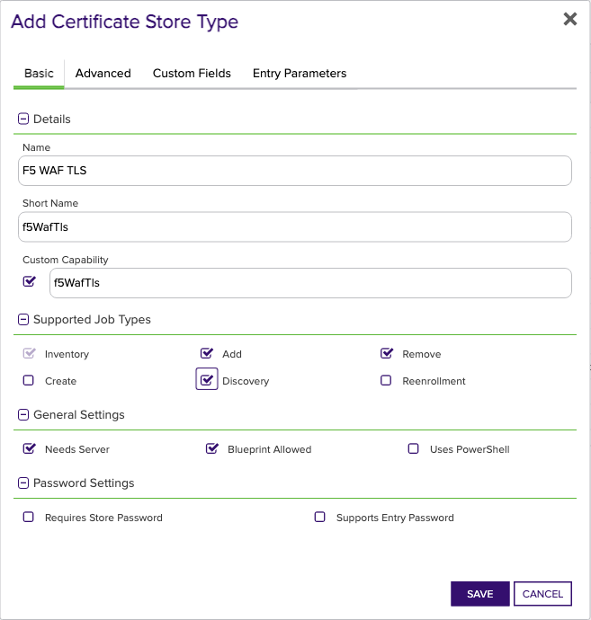
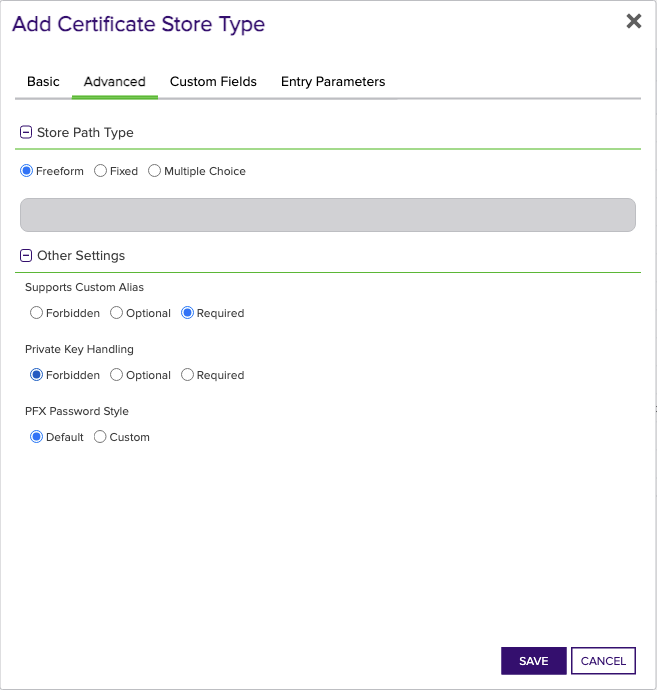
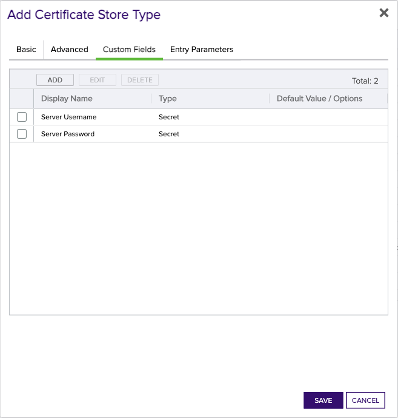

<h1 align="center" style="border-bottom: none">
    F5 WAF Universal Orchestrator Extension
</h1>

<p align="center">
  <!-- Badges -->

<a href="https://github.com/Keyfactor/f5-waf-orchestrator/releases"></a>


</p>

<p align="center">
  <!-- TOC -->
  <a href="#support">
    <b>Support</b>
  </a>
  ·
  <a href="#installation">
    <b>Installation</b>
  </a>
  ·
  <a href="#license">
    <b>License</b>
  </a>
  ·
  <a href="https://github.com/orgs/Keyfactor/repositories?q=orchestrator">
    <b>Related Integrations</b>
  </a>
</p>

## Overview

The F5 WAF Orchestrator extension remotely manages TLS and CA Root certificates uploaded to F5 Distributed Multi-Cloud App Connect, which is the F5 platform that manages WAF services. Certificates bound to Http Load Balancers within Multi-Cloud App Connect can be renewed/replaced, but they cannot be removed. Certificate store types f5WafTls and f5WafCa are used to manage stores containing TLS and CA Root certificates, respectively.

The F5 WAF Universal Orchestrator extension implements 2 Certificate Store Types. Depending on your use case, you may elect to use one, or both of these Certificate Store Types. Descriptions of each are provided below.

<details><summary>F5 WAF TLS (f5WafTls)</summary>


### f5WafTls
TODO Global Store Type Section is an optional section. If this section doesn't seem necessary on initial glance, please delete it. Refer to the docs on [Confluence](https://keyfactor.atlassian.net/wiki/x/SAAyHg) for more info


TODO Overview is a required section
</details>

<details><summary>F5 WAF CA (f5WafCa)</summary>


### f5WafCa

The f5WafCa certificate store type is used to manage F5 Distributed Multi-Cloud App Connect CA Root certificates.

Use cases supported:
1. Discovery of TLS stores.  Discovery for F5 WAF returns any discoverable namespaces in the F5 WAF instance.
2. Inventory of a TLS store.  All CA Root certificates within a namespace will be returned to Keyfactor Command.
3. Management-Add.  Add a new certificate or renew an existing one.
4. Management-Delete.  Remove an existing certificate.  Please note, for CA Root certicates, deleting an existing certificate will replace ALL instances of the same certificate and not only the one represented by the intended alias.  This is an F5 WAF feature that the integration has no control over.
</details>


## Compatibility

This integration is compatible with Keyfactor Universal Orchestrator version 10.4.1 and later.

## Support
The F5 WAF Universal Orchestrator extension is supported by Keyfactor for Keyfactor customers. If you have a support issue, please open a support ticket with your Keyfactor representative. If you have a support issue, please open a support ticket via the Keyfactor Support Portal at https://support.keyfactor.com. 
 
> To report a problem or suggest a new feature, use the **[Issues](../../issues)** tab. If you want to contribute actual bug fixes or proposed enhancements, use the **[Pull requests](../../pulls)** tab.

## Requirements & Prerequisites

Before installing the F5 WAF Universal Orchestrator extension, we recommend that you install [kfutil](https://github.com/Keyfactor/kfutil). Kfutil is a command-line tool that simplifies the process of creating store types, installing extensions, and instantiating certificate stores in Keyfactor Command.


F5 Multi-Cloud App Connect uses API tokens to authenticate when calling APIs.  API Tokens can be created through the F5 Distributed Cloud Console.  Once logged in, select Multi-Cloud App Connect from the options under "Common services".  Next, select Account Services from the pull down at the top right of the screen, and select "Account Settings".  From there, click on "Credentials" on the left nav and "Add Credentials" on the subsequent screen.  In the form shown, select "API Token" from the Credential Type dropdown, and enter the name of the credential and the expiration date.  Please note that credentials can only be created for up to 90 day periods of time.  After 90 days, a new API token will need to be generated and replaced in your F5 WAF certificate store(s).  Clicking Generate will then show the value of the newly created API Token.  Copy this and save to a safe place, as this will be the value you will enter in the Server Password field when setting up your certificate store.  If you forget or lose this token value, there is no way to access it again in the F5 Distributed Cloud portal.  You will need to create a new API Token.


<details><summary>F5 WAF TLS (f5WafTls)</summary>

### F5 WAF TLS Requirements
TODO Global Store Type Section is an optional section. If this section doesn't seem necessary on initial glance, please delete it. Refer to the docs on [Confluence](https://keyfactor.atlassian.net/wiki/x/SAAyHg) for more info


TODO Requirements is an optional section. If this section doesn't seem necessary on initial glance, please delete it. Refer to the docs on [Confluence](https://keyfactor.atlassian.net/wiki/x/SAAyHg) for more info
</details>


## Create Certificate Store Types

To use the F5 WAF Universal Orchestrator extension, you **must** create the Certificate Store Types required for your usecase. This only needs to happen _once_ per Keyfactor Command instance.

The F5 WAF Universal Orchestrator extension implements 2 Certificate Store Types. Depending on your use case, you may elect to use one, or both of these Certificate Store Types.

<details><summary>F5 WAF TLS (f5WafTls)</summary>

TODO Global Store Type Section is an optional section. If this section doesn't seem necessary on initial glance, please delete it. Refer to the docs on [Confluence](https://keyfactor.atlassian.net/wiki/x/SAAyHg) for more info


* **Create f5WafTls using kfutil**:

    ```shell
    # F5 WAF TLS
    kfutil store-types create f5WafTls
    ```

* **Create f5WafTls manually in the Command UI**:
    <details><summary>Create f5WafTls manually in the Command UI</summary>

    Create a store type called `f5WafTls` with the attributes in the tables below:

    #### Basic Tab
    | Attribute | Value | Description |
    | --------- | ----- | ----- |
    | Name | F5 WAF TLS | Display name for the store type (may be customized) |
    | Short Name | f5WafTls | Short display name for the store type |
    | Capability | f5WafTls | Store type name orchestrator will register with. Check the box to allow entry of value |
    | Supports Add | ✅ Checked | Check the box. Indicates that the Store Type supports Management Add |
    | Supports Remove | ✅ Checked | Check the box. Indicates that the Store Type supports Management Remove |
    | Supports Discovery | ✅ Checked | Check the box. Indicates that the Store Type supports Discovery |
    | Supports Reenrollment | 🔲 Unchecked |  Indicates that the Store Type supports Reenrollment |
    | Supports Create | 🔲 Unchecked |  Indicates that the Store Type supports store creation |
    | Needs Server | ✅ Checked | Determines if a target server name is required when creating store |
    | Blueprint Allowed | ✅ Checked | Determines if store type may be included in an Orchestrator blueprint |
    | Uses PowerShell | 🔲 Unchecked | Determines if underlying implementation is PowerShell |
    | Requires Store Password | 🔲 Unchecked | Enables users to optionally specify a store password when defining a Certificate Store. |
    | Supports Entry Password | 🔲 Unchecked | Determines if an individual entry within a store can have a password. |

    The Basic tab should look like this:

    

    #### Advanced Tab
    | Attribute | Value | Description |
    | --------- | ----- | ----- |
    | Supports Custom Alias | Required | Determines if an individual entry within a store can have a custom Alias. |
    | Private Key Handling | Required | This determines if Keyfactor can send the private key associated with a certificate to the store. Required because IIS certificates without private keys would be invalid. |
    | PFX Password Style | Default | 'Default' - PFX password is randomly generated, 'Custom' - PFX password may be specified when the enrollment job is created (Requires the Allow Custom Password application setting to be enabled.) |

    The Advanced tab should look like this:

    

    #### Custom Fields Tab
    Custom fields operate at the certificate store level and are used to control how the orchestrator connects to the remote target server containing the certificate store to be managed. The following custom fields should be added to the store type:

    | Name | Display Name | Description | Type | Default Value/Options | Required |
    | ---- | ------------ | ---- | --------------------- | -------- | ----------- |
    | ServerUsername | Server Username | Not used, but a value is required.  Enter anything into this field. | Secret |  | 🔲 Unchecked |
    | ServerPassword | Server Password | The API Token configured in the F5 Distributed Cloud instance's Account Settings. Please see [Creating an F5 WAF API Token](https://github.com/Keyfactor/f5-waf-orchestrator#creating-an-f5-waf-api-token) for more details on creating this token. | Secret |  | 🔲 Unchecked |

    The Custom Fields tab should look like this:

    


    </details>
</details>

<details><summary>F5 WAF CA (f5WafCa)</summary>


* **Create f5WafCa using kfutil**:

    ```shell
    # F5 WAF CA
    kfutil store-types create f5WafCa
    ```

* **Create f5WafCa manually in the Command UI**:
    <details><summary>Create f5WafCa manually in the Command UI</summary>

    Create a store type called `f5WafCa` with the attributes in the tables below:

    #### Basic Tab
    | Attribute | Value | Description |
    | --------- | ----- | ----- |
    | Name | F5 WAF CA | Display name for the store type (may be customized) |
    | Short Name | f5WafCa | Short display name for the store type |
    | Capability | f5WafCa | Store type name orchestrator will register with. Check the box to allow entry of value |
    | Supports Add | ✅ Checked | Check the box. Indicates that the Store Type supports Management Add |
    | Supports Remove | ✅ Checked | Check the box. Indicates that the Store Type supports Management Remove |
    | Supports Discovery | ✅ Checked | Check the box. Indicates that the Store Type supports Discovery |
    | Supports Reenrollment | 🔲 Unchecked |  Indicates that the Store Type supports Reenrollment |
    | Supports Create | 🔲 Unchecked |  Indicates that the Store Type supports store creation |
    | Needs Server | ✅ Checked | Determines if a target server name is required when creating store |
    | Blueprint Allowed | ✅ Checked | Determines if store type may be included in an Orchestrator blueprint |
    | Uses PowerShell | 🔲 Unchecked | Determines if underlying implementation is PowerShell |
    | Requires Store Password | 🔲 Unchecked | Enables users to optionally specify a store password when defining a Certificate Store. |
    | Supports Entry Password | 🔲 Unchecked | Determines if an individual entry within a store can have a password. |

    The Basic tab should look like this:

    

    #### Advanced Tab
    | Attribute | Value | Description |
    | --------- | ----- | ----- |
    | Supports Custom Alias | Required | Determines if an individual entry within a store can have a custom Alias. |
    | Private Key Handling | Forbidden | This determines if Keyfactor can send the private key associated with a certificate to the store. Required because IIS certificates without private keys would be invalid. |
    | PFX Password Style | Default | 'Default' - PFX password is randomly generated, 'Custom' - PFX password may be specified when the enrollment job is created (Requires the Allow Custom Password application setting to be enabled.) |

    The Advanced tab should look like this:

    

    #### Custom Fields Tab
    Custom fields operate at the certificate store level and are used to control how the orchestrator connects to the remote target server containing the certificate store to be managed. The following custom fields should be added to the store type:

    | Name | Display Name | Description | Type | Default Value/Options | Required |
    | ---- | ------------ | ---- | --------------------- | -------- | ----------- |
    | ServerUsername | Server Username | Not used, but a value is required.  Enter anything into this field. | Secret |  | 🔲 Unchecked |
    | ServerPassword | Server Password | The API Token configured in the F5 Distributed Cloud instance's Account Settings. Please see [Creating an F5 WAF API Token](https://github.com/Keyfactor/f5-waf-orchestrator#creating-an-f5-waf-api-token) for more details on creating this token. | Secret |  | 🔲 Unchecked |

    The Custom Fields tab should look like this:

    


    </details>
</details>


## Installation

1. **Download the latest F5 WAF Universal Orchestrator extension from GitHub.** 

    Navigate to the [F5 WAF Universal Orchestrator extension GitHub version page](https://github.com/Keyfactor/f5-waf-orchestrator/releases/latest). Refer to the compatibility matrix below to determine whether the `net6.0` or `net8.0` asset should be downloaded. Then, click the corresponding asset to download the zip archive.
    | Universal Orchestrator Version | Latest .NET version installed on the Universal Orchestrator server | `rollForward` condition in `Orchestrator.runtimeconfig.json` | `f5-waf-orchestrator` .NET version to download |
    | --------- | ----------- | ----------- | ----------- |
    | Older than `11.0.0` | | | `net6.0` |
    | Between `11.0.0` and `11.5.1` (inclusive) | `net6.0` | | `net6.0` | 
    | Between `11.0.0` and `11.5.1` (inclusive) | `net8.0` | `Disable` | `net6.0` | 
    | Between `11.0.0` and `11.5.1` (inclusive) | `net8.0` | `LatestMajor` | `net8.0` | 
    | `11.6` _and_ newer | `net8.0` | | `net8.0` |

    Unzip the archive containing extension assemblies to a known location.

    > **Note** If you don't see an asset with a corresponding .NET version, you should always assume that it was compiled for `net6.0`.

2. **Locate the Universal Orchestrator extensions directory.**

    * **Default on Windows** - `C:\Program Files\Keyfactor\Keyfactor Orchestrator\extensions`
    * **Default on Linux** - `/opt/keyfactor/orchestrator/extensions`
    
3. **Create a new directory for the F5 WAF Universal Orchestrator extension inside the extensions directory.**
        
    Create a new directory called `f5-waf-orchestrator`.
    > The directory name does not need to match any names used elsewhere; it just has to be unique within the extensions directory.

4. **Copy the contents of the downloaded and unzipped assemblies from __step 2__ to the `f5-waf-orchestrator` directory.**

5. **Restart the Universal Orchestrator service.**

    Refer to [Starting/Restarting the Universal Orchestrator service](https://software.keyfactor.com/Core-OnPrem/Current/Content/InstallingAgents/NetCoreOrchestrator/StarttheService.htm).


6. **(optional) PAM Integration** 

    The F5 WAF Universal Orchestrator extension is compatible with all supported Keyfactor PAM extensions to resolve PAM-eligible secrets. PAM extensions running on Universal Orchestrators enable secure retrieval of secrets from a connected PAM provider.

    To configure a PAM provider, [reference the Keyfactor Integration Catalog](https://keyfactor.github.io/integrations-catalog/content/pam) to select an extension, and follow the associated instructions to install it on the Universal Orchestrator (remote).


> The above installation steps can be supplimented by the [official Command documentation](https://software.keyfactor.com/Core-OnPrem/Current/Content/InstallingAgents/NetCoreOrchestrator/CustomExtensions.htm?Highlight=extensions).


## Defining Certificate Stores

The F5 WAF Universal Orchestrator extension implements 2 Certificate Store Types, each of which implements different functionality. Refer to the individual instructions below for each Certificate Store Type that you deemed necessary for your use case from the installation section.

<details><summary>F5 WAF TLS (f5WafTls)</summary>

TODO Global Store Type Section is an optional section. If this section doesn't seem necessary on initial glance, please delete it. Refer to the docs on [Confluence](https://keyfactor.atlassian.net/wiki/x/SAAyHg) for more info

TODO Certificate Store Configuration is an optional section. If this section doesn't seem necessary on initial glance, please delete it. Refer to the docs on [Confluence](https://keyfactor.atlassian.net/wiki/x/SAAyHg) for more info


> The content in this section can be supplimented by the [official Command documentation](https://software.keyfactor.com/Core-OnPrem/Current/Content/ReferenceGuide/Certificate%20Stores.htm?Highlight=certificate%20store).


</details>

<details><summary>F5 WAF CA (f5WafCa)</summary>


* **Manually with the Command UI**

    <details><summary>Create Certificate Stores manually in the UI</summary>

    1. **Navigate to the _Certificate Stores_ page in Keyfactor Command.**

        Log into Keyfactor Command, toggle the _Locations_ dropdown, and click _Certificate Stores_.

    2. **Add a Certificate Store.**

        Click the Add button to add a new Certificate Store. Use the table below to populate the **Attributes** in the **Add** form.
        | Attribute | Description |
        | --------- | ----------- |
        | Category | Select "F5 WAF CA" or the customized certificate store name from the previous step. |
        | Container | Optional container to associate certificate store with. |
        | Client Machine | The URL for the F5 Distributed Cloud instance (typically ending in '.console.ves.volterra.io'). |
        | Store Path | The Multi-Cloud App Connect namespace containing the certificates you wish to manage. |
        | Orchestrator | Select an approved orchestrator capable of managing `f5WafCa` certificates. Specifically, one with the `f5WafCa` capability. |
        | ServerUsername | Not used, but a value is required.  Enter anything into this field. |
        | ServerPassword | The API Token configured in the F5 Distributed Cloud instance's Account Settings. Please see [Creating an F5 WAF API Token](https://github.com/Keyfactor/f5-waf-orchestrator#creating-an-f5-waf-api-token) for more details on creating this token. |


        

        <details><summary>Attributes eligible for retrieval by a PAM Provider on the Universal Orchestrator</summary>

        If a PAM provider was installed _on the Universal Orchestrator_ in the [Installation](#Installation) section, the following parameters can be configured for retrieval _on the Universal Orchestrator_.
        | Attribute | Description |
        | --------- | ----------- |
        | ServerPassword | The API Token configured in the F5 Distributed Cloud instance's Account Settings. Please see [Creating an F5 WAF API Token](https://github.com/Keyfactor/f5-waf-orchestrator#creating-an-f5-waf-api-token) for more details on creating this token. |


        Please refer to the **Universal Orchestrator (remote)** usage section ([PAM providers on the Keyfactor Integration Catalog](https://keyfactor.github.io/integrations-catalog/content/pam)) for your selected PAM provider for instructions on how to load attributes orchestrator-side.

        > Any secret can be rendered by a PAM provider _installed on the Keyfactor Command server_. The above parameters are specific to attributes that can be fetched by an installed PAM provider running on the Universal Orchestrator server itself. 
        </details>
        

    </details>

* **Using kfutil**
    
    <details><summary>Create Certificate Stores with kfutil</summary>
    
    1. **Generate a CSV template for the f5WafCa certificate store**

        ```shell
        kfutil stores import generate-template --store-type-name f5WafCa --outpath f5WafCa.csv
        ```
    2. **Populate the generated CSV file**

        Open the CSV file, and reference the table below to populate parameters for each **Attribute**.
        | Attribute | Description |
        | --------- | ----------- |
        | Category | Select "F5 WAF CA" or the customized certificate store name from the previous step. |
        | Container | Optional container to associate certificate store with. |
        | Client Machine | The URL for the F5 Distributed Cloud instance (typically ending in '.console.ves.volterra.io'). |
        | Store Path | The Multi-Cloud App Connect namespace containing the certificates you wish to manage. |
        | Orchestrator | Select an approved orchestrator capable of managing `f5WafCa` certificates. Specifically, one with the `f5WafCa` capability. |
        | ServerUsername | Not used, but a value is required.  Enter anything into this field. |
        | ServerPassword | The API Token configured in the F5 Distributed Cloud instance's Account Settings. Please see [Creating an F5 WAF API Token](https://github.com/Keyfactor/f5-waf-orchestrator#creating-an-f5-waf-api-token) for more details on creating this token. |


        

        <details><summary>Attributes eligible for retrieval by a PAM Provider on the Universal Orchestrator</summary>

        If a PAM provider was installed _on the Universal Orchestrator_ in the [Installation](#Installation) section, the following parameters can be configured for retrieval _on the Universal Orchestrator_.
        | Attribute | Description |
        | --------- | ----------- |
        | ServerPassword | The API Token configured in the F5 Distributed Cloud instance's Account Settings. Please see [Creating an F5 WAF API Token](https://github.com/Keyfactor/f5-waf-orchestrator#creating-an-f5-waf-api-token) for more details on creating this token. |


        > Any secret can be rendered by a PAM provider _installed on the Keyfactor Command server_. The above parameters are specific to attributes that can be fetched by an installed PAM provider running on the Universal Orchestrator server itself. 
        </details>
        

    3. **Import the CSV file to create the certificate stores** 

        ```shell
        kfutil stores import csv --store-type-name f5WafCa --file f5WafCa.csv
        ```
    </details>

> The content in this section can be supplimented by the [official Command documentation](https://software.keyfactor.com/Core-OnPrem/Current/Content/ReferenceGuide/Certificate%20Stores.htm?Highlight=certificate%20store).


</details>

## Discovering Certificate Stores with the Discovery Job
The following table describes the required and optional fields to schedule a Discovery job for the `f5WafTls` and `f5WafCa` certificate store types.

In Keyfactor Command, navigate to Certificate Stores from the Locations Menu and then click on the Discover tab.

| Attribute | Description                                                                                                                                    |
| --------- |------------------------------------------------------------------------------------------------------------------------------------------------|
| Category | Select either F5WafTls or F5WafCa depending on whether you want to return namespaces for TLS certificates or CA Root certificates.                                        |
| Orchestrator | Select an approved orchestrator capable of managing F5 WAF certificates. Specifically, one with the f5WafTls and f5WafCa capabilities.         |
| Schedule | Enter the schedule for when you want the job to run   |
| Client Machine | The URL for the F5 Distributed Cloud instance (typically ending in '.console.ves.volterra.io'.                                                 |
| Server Username | This is not used but required in the UI.  Enter any value. |
| Server Password | The API Token configured in the F5 Distributed Cloud instance's Account Settings.  Please see [Requirements](#requirements) for more details on creating this token.  |
| Directories to Search | Not used for this integration.  Leave Blank.  |
| Directories to ignore | Not used for this integration.  Leave Blank.  |
| Extensions | Not used for this integration.  Leave Blank.  |
| File name patterns to match | Not used for this integration.  Leave Blank.  |
| Follow SymLinks | Not used for this integration.  Leave Unchecked.  |  
| Follow SymLinks | Not used for this integration.  Leave Unchecked.  |  
| Use SSL? | Not used for this integration.  Leave Unchecked.  |  

Discovery jobs will return all known namespaces for this F5 WAF instance.  Please note that because Keyfactor Command has a restriction on multiple certificate stores having the same Client Machine and Store Path, certificate stores for f5WafTls will return stores with a "tls-" prefixed to the beginning of the store path (namespace); while f5WafCA stores will have "ca-" prefixed.  Any jobs that run for stores with these prefixes will have these prefixes removed before calling any F5 WAF APIs.  What this means is a store path (namespace) for an f5WafTls store of "tls-namespace1" will be the same as one labeled "namespace1".


### F5 WAF TLS Discovery Job
TODO Global Store Type Section is an optional section. If this section doesn't seem necessary on initial glance, please delete it. Refer to the docs on [Confluence](https://keyfactor.atlassian.net/wiki/x/SAAyHg) for more info


TODO Discovery Job Configuration is an optional section. If this section doesn't seem necessary on initial glance, please delete it. Refer to the docs on [Confluence](https://keyfactor.atlassian.net/wiki/x/SAAyHg) for more info


## License

Apache License 2.0, see [LICENSE](LICENSE).

## Related Integrations

See all [Keyfactor Universal Orchestrator extensions](https://github.com/orgs/Keyfactor/repositories?q=orchestrator).