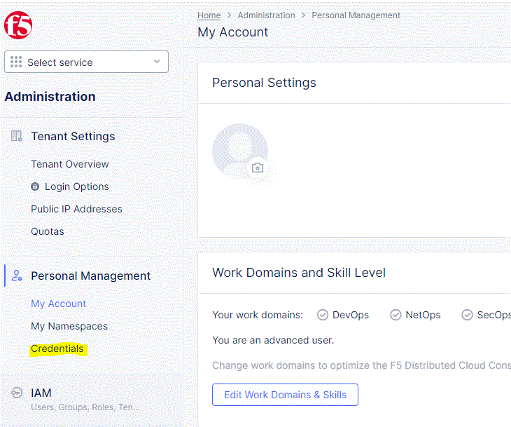
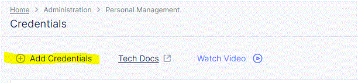

# F5 WAF

The F5 WAF Orchestrator is an extension to the Keyfactor Universal Orchestrator. It Integrates with the Multi-Cloud App Connect, which is F5 Distributed Cloud's service for connecting apps across clouds, edge and on premises using load balancers. The purpose of the F5 WAF orchestrator is to manage the TLS certificates that are bound to the load balancers. This also includes managing the intermediate certificate chains and root CAs of these TLS certificates. The orchestrator facilitates the inventory, addition, removal, and discovery of certificates intended for use with load balancers. 

#### Integration status: Pilot - Ready for use in test environments. Not for use in production.

## About the Keyfactor Universal Orchestrator Extension

This repository contains a Universal Orchestrator Extension which is a plugin to the Keyfactor Universal Orchestrator. Within the Keyfactor Platform, Orchestrators are used to manage “certificate stores” &mdash; collections of certificates and roots of trust that are found within and used by various applications.

The Universal Orchestrator is part of the Keyfactor software distribution and is available via the Keyfactor customer portal. For general instructions on installing Extensions, see the “Keyfactor Command Orchestrator Installation and Configuration Guide” section of the Keyfactor documentation. For configuration details of this specific Extension see below in this readme.

The Universal Orchestrator is the successor to the Windows Orchestrator. This Orchestrator Extension plugin only works with the Universal Orchestrator and does not work with the Windows Orchestrator.

## Support for F5 WAF

F5 WAF is supported by Keyfactor for Keyfactor customers. If you have a support issue, please open a support ticket via the Keyfactor Support Portal at https://support.keyfactor.com

###### To report a problem or suggest a new feature, use the **[Issues](../../issues)** tab. If you want to contribute actual bug fixes or proposed enhancements, use the **[Pull requests](../../pulls)** tab.

---

---

## Keyfactor Version Supported

The minimum version of the Keyfactor Universal Orchestrator Framework needed to run this version of the extension is 10.4.1
## Platform Specific Notes

The Keyfactor Universal Orchestrator may be installed on either Windows or Linux based platforms. The certificate operations supported by a capability may vary based what platform the capability is installed on. The table below indicates what capabilities are supported based on which platform the encompassing Universal Orchestrator is running.
| Operation | Win | Linux |
|-----|-----|------|
|Supports Management Add|&check; |&check; |
|Supports Management Remove|&check; |&check; |
|Supports Create Store|  |  |
|Supports Discovery|&check; |&check; |
|Supports Reenrollment|  |  |
|Supports Inventory|&check; |&check; |

## PAM Integration

This orchestrator extension has the ability to connect to a variety of supported PAM providers to allow for the retrieval of various client hosted secrets right from the orchestrator server itself.  This eliminates the need to set up the PAM integration on Keyfactor Command which may be in an environment that the client does not want to have access to their PAM provider.

The secrets that this orchestrator extension supports for use with a PAM Provider are:

|Name|Description|
|----|-----------|
|ServerUsername|The user id that will be used to authenticate to the F5 WAF API endpoints|
|ServerPassword|The API token that will be used to authenticate to the F5 WAF API endpoints|
  

It is not necessary to use a PAM Provider for all of the secrets available above. If a PAM Provider should not be used, simply enter in the actual value to be used, as normal.

If a PAM Provider will be used for one of the fields above, start by referencing the [Keyfactor Integration Catalog](https://keyfactor.github.io/integrations-catalog/content/pam). The GitHub repo for the PAM Provider to be used contains important information such as the format of the `json` needed. What follows is an example but does not reflect the `json` values for all PAM Providers as they have different "instance" and "initialization" parameter names and values.

General PAM Provider Configuration

### Example PAM Provider Setup

To use a PAM Provider to resolve a field, in this example the __Server Password__ will be resolved by the `Hashicorp-Vault` provider, first install the PAM Provider extension from the [Keyfactor Integration Catalog](https://keyfactor.github.io/integrations-catalog/content/pam) on the Universal Orchestrator.

Next, complete configuration of the PAM Provider on the UO by editing the `manifest.json` of the __PAM Provider__ (e.g. located at extensions/Hashicorp-Vault/manifest.json). The "initialization" parameters need to be entered here:

~~~ json
  "Keyfactor:PAMProviders:Hashicorp-Vault:InitializationInfo": {
    "Host": "http://127.0.0.1:8200",
    "Path": "v1/secret/data",
    "Token": "xxxxxx"
  }
~~~

After these values are entered, the Orchestrator needs to be restarted to pick up the configuration. Now the PAM Provider can be used on other Orchestrator Extensions.

### Use the PAM Provider
With the PAM Provider configured as an extenion on the UO, a `json` object can be passed instead of an actual value to resolve the field with a PAM Provider. Consult the [Keyfactor Integration Catalog](https://keyfactor.github.io/integrations-catalog/content/pam) for the specific format of the `json` object.

To have the __Server Password__ field resolved by the `Hashicorp-Vault` provider, the corresponding `json` object from the `Hashicorp-Vault` extension needs to be copied and filed in with the correct information:

~~~ json
{"Secret":"my-kv-secret","Key":"myServerPassword"}
~~~

This text would be entered in as the value for the __Server Password__, instead of entering in the actual password. The Orchestrator will attempt to use the PAM Provider to retrieve the __Server Password__. If PAM should not be used, just directly enter in the value for the field.

 

---

## Overview
The F5 WAF Orchestrator extension remotely manages TLS and CA Root certificates uploaded to F5 Distributed Multi-Cloud App Connect, which is the F5 platform that manages WAF services. Certificates bound to Http Load Balancers within Multi-Cloud App Connect can be renewed/replaced, but they cannot be removed.  Certificate store types f5WafTls and f5WafCa are used to manage stores containing TLS and CA Root certificates, respectively.

f5WafTls

The f5WafTls certificate store type is used to manage F5 Distributed Multi-Cloud App Connect TLS certificates.

Use cases supported:
1. Discovery of TLS stores.  Discovery for F5 WAF returns any discoverable namespaces in the F5 WAF instance.
2. Inventory of a TLS store.  All TLS certificates, bound or unbound, within a namespace will be returned to Keyfactor Command.
3. Management-Add.  Add a new certificate or renew an existing one.  Renew will work for both bound and unbound certificates.  All existing binding will remain in place, bound to the same alias with the newly replaced/renewed certificate.
4. Management-Delete.  Remove an existing certificate.  Will only work for unbound certificates.

f5WafCa

The f5WafCa certificate store type is used to manage F5 Distributed Multi-Cloud App Connect CA Root certificates.

Use cases supported:
1. Discovery of TLS stores.  Discovery for F5 WAF returns any discoverable namespaces in the F5 WAF instance.
2. Inventory of a TLS store.  All CA Root certificates within a namespace will be returned to Keyfactor Command.
3. Management-Add.  Add a new certificate or renew an existing one.
4. Management-Delete.  Remove an existing certificate.  Please note, for CA Root certicates, deleting an existing certificate will replace ALL instances of the same certificate and not only the one represented by the intended alias.  This is an F5 WAF feature that the integration has no control over.

## F5 WAF Orchestrator Extension Installation

1. Refer to the [Creating Certificate Store Types](#creating-certificate-store-types) section to create the certificate store types you wish to manage.
2. Stop the Keyfactor Universal Orchestrator Service on the server you plan to install this extension to run on.
3. In the Keyfactor Orchestrator installation folder (by convention usually C:\Program Files\Keyfactor\Keyfactor Orchestrator for a Windows install or /opt/keyfactor/orchestrator/ for a Linux install), find the "Extensions" folder. Underneath that, create a new folder named "F5Waf". You may choose to use a different name if you wish.
4. Download the latest version of the F5 WAF orchestrator extension from [GitHub](https://github.com/Keyfactor/f5-waf-orchestrator).  Click on the "Latest" release link on the right hand side of the main page and download the first zip file.
5. Copy the contents of the download installation zip file to the folder created in step 3.
6. (Optional) If you decide to create one or more certificate store types with short names different than the suggested values, edit the manifest.json file in the folder you created in step 3, and modify each "ShortName" in each "Certstores.{ShortName}.{Operation}" line with the ShortName you used to create the respective certificate store type.
7. Start the Keyfactor Universal Orchestrator Service.

## Creating Certificate Store Types

Below are the two certificate store types that the F5 WAF Orchestator Extension manages.  To create a new Certificate Store Type in Keyfactor Command, first click on settings (the gear icon on the top right) => Certificate Store Types => Add.  Next, follow the instructions under each store type you wish to set up.

  

f5WafTls - TLS certificates in a namespace

- <i>Basic Tab:</i>

  - **Name** – Required. The display name you wish to use for the new Certificate Store Type.
  - **Short Name** – Required. Suggested value - **f5WafTls**.  If you choose to use a different value you must make the corresponding modification to the manifest.json file.  See [F5 WAF Orchestrator Extension Installation](#f5-waf-orchestrator-extension-installation), step 6 above.
  - **Custom Capability** - Unchecked
  - **Supported Job Types** - Inventory, Add, Remove, and Discovery should all be checked.
  - **Needs Server** - Checked
  - **Blueprint Allowed** - Checked if you wish to make use of blueprinting.  Please refer to the Keyfactor Command Reference Guide for more details on this feature.
  - **Uses PowerShell** - Unchecked
  - **Requires Store Password** - Unchecked
  - **Supports Entry Password** - Unchecked  

- <i>Advanced Tab:</i>

  - **Store Path Type** - Freeform
  - **Supports Custom Alias** - Required.
  - **Private Key Handling** - Required.  
  - **PFX Password Style** - Default  

- <i>Custom Fields Tab:</i>

  - no additional custom fields  

- <i>Entry Parameters Tab:</i>

  - no additional entry parameters  

  

  

f5WafCa - CA Root certificates in a namespace

- <i>Basic Tab:</i>

  - **Name** – Required. The display name you wish to use for the new Certificate Store Type.
  - **Short Name** – Required. Suggested value - **f5WafCa**.  If you choose to use a different value you must make the corresponding modification to the manifest.json file.  See [F5 WAF Orchestrator Extension Installation](#f5-waf-orchestrator-extension-installation), step 6 above.
  - **Custom Capability** - Unchecked
  - **Supported Job Types** - Inventory, Add, Remove, and Discovery should all be checked.
  - **Needs Server** - Checked
  - **Blueprint Allowed** - Checked if you wish to make use of blueprinting.  Please refer to the Keyfactor Command Reference Guide for more details on this feature.
  - **Uses PowerShell** - Unchecked
  - **Requires Store Password** - Unchecked
  - **Supports Entry Password** - Unchecked  

- <i>Advanced Tab:</i>

  - **Store Path Type** - Freeform
  - **Supports Custom Alias** - Required.
  - **Private Key Handling** - Forbidden.  
  - **PFX Password Style** - Default  

- <i>Custom Fields Tab:</i>

  - no additional custom fields  

- <i>Entry Parameters Tab:</i>

  - no additional entry parameters  

  

## Creating Certificate Stores and Scheduling Discovery Jobs

When creating new certificate stores or scheduling discovery jobs in Keyfactor Command, there are a few fields that are important to highlight here:

Certificate Stores

The following table describes the required and optional fields for the `f5WafTls` and `f5WafCa` certificate store types when creating a certificate store.

In Keyfactor Command, navigate to Certificate Stores from the Locations Menu. Click the Add button to create a new Certificate Store.

| Attribute | Description                                                                                                                                    |
| --------- |------------------------------------------------------------------------------------------------------------------------------------------------|
| Category | Select either f5WafTls or f5WafCa depending on whether you want to manage TLS certificates or Root CA certificates.                                        |
| Container | Optional container to associate certificate store with.                                                                                        |
| Client Machine | The URL for the F5 Distributed Cloud instance (typically ending in '.console.ves.volterra.io'.                                                 |
| Store Path | The Multi-Cloud App Connect namespace containing the certificates you wish to manage.                                                          |
| Orchestrator | Select an approved orchestrator capable of managing F5 WAF certificates. Specifically, one with the f5WafTls and f5WafCa capabilities.         |
| Server Username | The username used to log in to the F5 Distributed Cloud instance (typically an email). |
| Server Password | The API Token configured in the F5 Distributed Cloud instance's Account Settings.  Please see [Creating an F5 WAF API Token](#creating-an-f5-waf-api-token) for more details on creating this token.  |
| Use SSL | Not used for this integration, so either setting is fine.                |

Discovery Jobs

The following table describes the required and optional fields to schedule a Discovery job for the `f5WafTls` and `f5WafCa` certificate store types.

In Keyfactor Command, navigate to Certificate Stores from the Locations Menu and then click on the Discover tab.

| Attribute | Description                                                                                                                                    |
| --------- |------------------------------------------------------------------------------------------------------------------------------------------------|
| Category | Select either F5WafTls or F5WafCa depending on whether you want to return namespaces for TLS certificates or CA Root certificates.                                        |
| Orchestrator | Select an approved orchestrator capable of managing F5 WAF certificates. Specifically, one with the f5WafTls and f5WafCa capabilities.         |
| Schedule | Enter the schedule for when you want the job to run   |
| Client Machine | The URL for the F5 Distributed Cloud instance (typically ending in '.console.ves.volterra.io'.                                                 |
| Server Username | The username used to log in to the F5 Distributed Cloud instance (typically an email). |
| Server Password | The API Token configured in the F5 Distributed Cloud instance's Account Settings.  Please see [Creating an F5 WAF API Token](#creating-an-f5-waf-api-token) for more details on creating this token.  |
| Directories to Search | Not used for this integration.  Leave Blank.  |
| Directories to ignore | Not used for this integration.  Leave Blank.  |
| Extensions | Not used for this integration.  Leave Blank.  |
| File name patterns to match | Not used for this integration.  Leave Blank.  |
| Follow SymLinks | Not used for this integration.  Leave Unchecked.  |  
| Follow SymLinks | Not used for this integration.  Leave Unchecked.  |  
| Use SSL? | Not used for this integration.  Leave Unchecked.  |  

Discovery jobs will return all known namespaces for this F5 WAF instance.  Please note that because Keyfactor Command has a restriction on multiple certificate stores having the same Client Machine and Store Path, certificate stores for f5WafTls will return stores with a "tls-" prefixed to the beginning of the store path (namespace); while f5WafCA stores will have "ca-" prefixed.  Any jobs that run for stores with these prefixes will have these prefixes removed before calling any F5 WAF APIs.  What this means is a store path (namespace) for an f5WafTls store of "tls-namespace1" will be the same as one labeled "namespace1".

## Creating an F5 WAF API Token

In lieu of providing a server password when setting up an F5 WAF certificate store, F5 Multi-Cloud App Connect uses API tokens combined with the user id to authenticate when calling APIs.  API Tokens can be created through the F5 Distributed Cloud Console after logging in with the ID you wish to use for the Keyfactor certificate store.  Once logged in, select Multi-Cloud App Connect from the options under "Common services".  Next, select Account Services from the pull down at the top right of the screen, and select "Account Settings".  From there, click on "Credentials" on the left nav and "Add Credentials" on the subsequent screen.  In the form shown, select "API Token" from the Credential Type dropdown, the name of the credential, and the expiration date.  Please note that credentials can only be create for up to 90 day periods of time.  After 90 days, a new API token will need to be generated and replaced in your F5 WAF certificate store(s).  Clicking Generate will then show the value of the newly created API Token.  Copy this and save to a safe place, as this will be the value you will enter in the Server Password field when setting up your certificate store.  If you forget or lose this token value, there is no way to access it again in the F5 Distributed Cloud portal.  You will need to create a new API Token.

When creating cert store type manually, that store property names and entry parameter names are case sensitive

