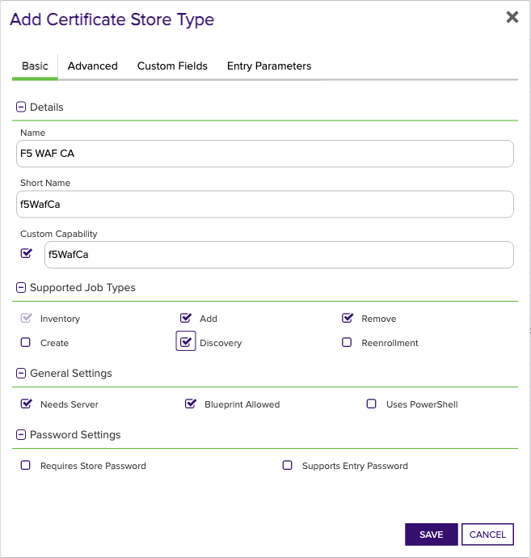

## F5 WAF CA

The `f5WafCa` certificate store type is designed to manage CA Root certificates within the F5 Distributed Multi-Cloud App Connect platform. CA Root certificates are critical components that establish a chain of trust between entities, ensuring the authenticity and reliability of certificates issued by intermediate Certificate Authorities.

### What does it represent?
The `f5WafCa` store type represents all CA Root certificates residing within a namespace on the F5 platform. This comprehensive management scope includes discovery, inventory, addition, renewal, and deletion of CA Root certificates within the specified namespace.

### Functionality
The `f5WafCa` certificate store type supports several key use cases, including:
1. **Discovery of CA Root stores**: Identifies and returns any discoverable namespaces in the F5 WAF instance.
2. **Inventory of a CA Root store**: Provides a complete inventory of all CA Root certificates within a namespace.
3. **Management-Add**: Allows the addition of new certificates or the renewal of existing ones.
4. **Management-Delete**: Supports the removal of existing certificates. However, deleting a CA Root certificate replaces all instances of the same certificate within the namespace, which is an intrinsic F5 WAF feature beyond the control of this integration.

### Caveats and Limitations
While the `f5WafCa` store type offers essential capabilities for managing CA Root certificates, there are some notable limitations and areas for potential confusion:
- **Replacing Multiple Instances**: Deleting a CA Root certificate will replace every instance of that certificate across the namespace, not just the one represented by the intended alias. Users must be cautious and aware of this behavior.
- **No SDK used**: This certificate store type does not utilize an SDK, relying instead on direct interactions with the F5 Distributed Multi-Cloud App Connect APIs.

Overall, the `f5WafCa` certificate store type is a powerful tool for managing CA Root certificates within the F5 platform, providing extensive functionality while also having specific limitations that users need to be aware of.


### Supported Job Types

| Job Name | Supported |
| -------- | --------- |
| Inventory | ✅ |
| Management Add | ✅ |
| Management Remove | ✅ |
| Discovery | ✅ |
| Create |  |
| Reenrollment |  |

## Requirements

### Creating an F5 WAF API Token

In lieu of providing a server password when setting up an F5 WAF certificate store, F5 Multi-Cloud App Connect uses API tokens combined with the user id to authenticate when calling APIs.  API Tokens can be created through the F5 Distributed Cloud Console after logging in with the ID you wish to use for the Keyfactor certificate store.  Once logged in, select Multi-Cloud App Connect from the options under "Common services".  Next, select Account Services from the pull down at the top right of the screen, and select "Account Settings".  From there, click on "Credentials" on the left nav and "Add Credentials" on the subsequent screen.  In the form shown, select "API Token" from the Credential Type dropdown, and enter the name of the credential and the expiration date.  Please note that credentials can only be created for up to 90 day periods of time.  After 90 days, a new API token will need to be generated and replaced in your F5 WAF certificate store(s).  Clicking Generate will then show the value of the newly created API Token.  Copy this and save to a safe place, as this will be the value you will enter in the Server Password field when setting up your certificate store.  If you forget or lose this token value, there is no way to access it again in the F5 Distributed Cloud portal.  You will need to create a new API Token.


## Certificate Store Type Configuration

The recommended method for creating the `f5WafCa` Certificate Store Type is to use [kfutil](https://github.com/Keyfactor/kfutil). After installing, use the following command to create the `` Certificate Store Type:

```shell
kfutil store-types create f5WafCa
```

<details><summary>f5WafCa</summary>

Create a store type called `f5WafCa` with the attributes in the tables below:

### Basic Tab
| Attribute | Value | Description |
| --------- | ----- | ----- |
| Name | F5 WAF CA | Display name for the store type (may be customized) |
| Short Name | f5WafCa | Short display name for the store type |
| Capability | f5WafCa | Store type name orchestrator will register with. Check the box to allow entry of value |
| Supported Job Types (check the box for each) | Add, Discovery, Remove | Job types the extension supports |
| Supports Add | ✅ | Check the box. Indicates that the Store Type supports Management Add |
| Supports Remove | ✅ | Check the box. Indicates that the Store Type supports Management Remove |
| Supports Discovery | ✅ | Check the box. Indicates that the Store Type supports Discovery |
| Supports Reenrollment |  |  Indicates that the Store Type supports Reenrollment |
| Supports Create |  |  Indicates that the Store Type supports store creation |
| Needs Server | ✅ | Determines if a target server name is required when creating store |
| Blueprint Allowed | ✅ | Determines if store type may be included in an Orchestrator blueprint |
| Uses PowerShell |  | Determines if underlying implementation is PowerShell |
| Requires Store Password |  | Determines if a store password is required when configuring an individual store. |
| Supports Entry Password |  | Determines if an individual entry within a store can have a password. |

The Basic tab should look like this:



### Advanced Tab
| Attribute | Value | Description |
| --------- | ----- | ----- |
| Supports Custom Alias | Required | Determines if an individual entry within a store can have a custom Alias. |
| Private Key Handling | Forbidden | This determines if Keyfactor can send the private key associated with a certificate to the store. Required because IIS certificates without private keys would be invalid. |
| PFX Password Style | Default | 'Default' - PFX password is randomly generated, 'Custom' - PFX password may be specified when the enrollment job is created (Requires the Allow Custom Password application setting to be enabled.) |

The Advanced tab should look like this:


### Custom Fields Tab
Custom fields operate at the certificate store level and are used to control how the orchestrator connects to the remote target server containing the certificate store to be managed. The following custom fields should be added to the store type:

| Name | Display Name | Type | Default Value/Options | Required | Description |
| ---- | ------------ | ---- | --------------------- | -------- | ----------- |


The Custom Fields tab should look like this:


</details>

## Certificate Store Configuration

After creating the `f5WafCa` Certificate Store Type and installing the F5 WAF Universal Orchestrator extension, you can create new [Certificate Stores](https://software.keyfactor.com/Core-OnPrem/Current/Content/ReferenceGuide/Certificate%20Stores.htm?Highlight=certificate%20store) to manage certificates in the remote platform.

The following table describes the required and optional fields for the `f5WafCa` certificate store type.

| Attribute | Description | Attribute is PAM Eligible |
| --------- | ----------- | ------------------------- |
| Category | Select "F5 WAF CA" or the customized certificate store name from the previous step. | |
| Container | Optional container to associate certificate store with. | |
| Client Machine | The URL for the F5 Distributed Cloud instance, typically formatted as 'https://<instance-name>.console.ves.volterra.io'. Example: 'https://example.console.ves.volterra.io'. | |
| Store Path | The namespace within Multi-Cloud App Connect that contains the CA Root certificates to be managed. Example: 'namespace1'. | |
| Orchestrator | Select an approved orchestrator capable of managing `f5WafCa` certificates. Specifically, one with the `f5WafCa` capability. | |

* **Using kfutil**

    ```shell
    # Generate a CSV template for the AzureApp certificate store
    kfutil stores import generate-template --store-type-name f5WafCa --outpath f5WafCa.csv

    # Open the CSV file and fill in the required fields for each certificate store.

    # Import the CSV file to create the certificate stores
    kfutil stores import csv --store-type-name f5WafCa --file f5WafCa.csv
    ```

* **Manually with the Command UI**: In Keyfactor Command, navigate to Certificate Stores from the Locations Menu. Click the Add button to create a new Certificate Store using the attributes in the table above.